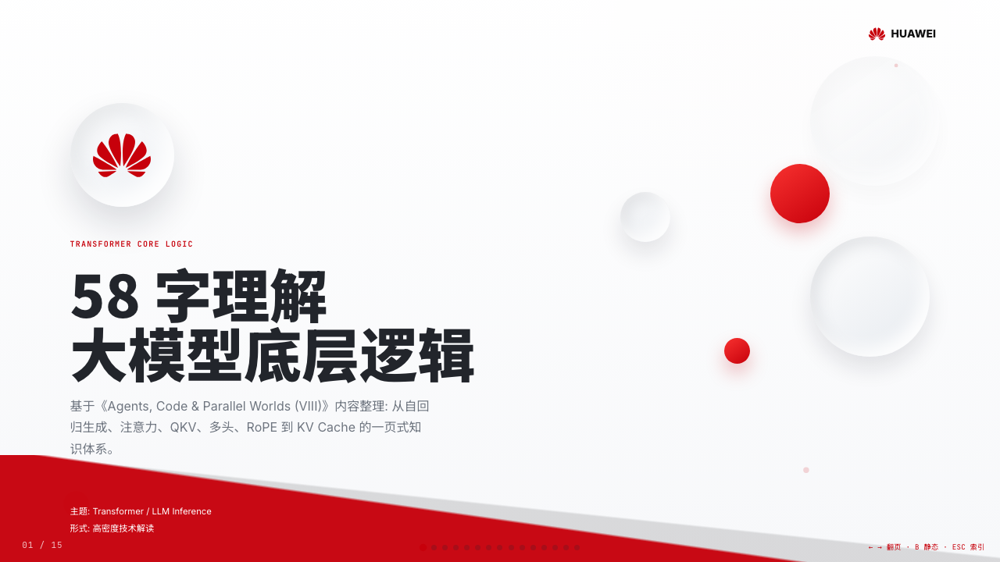
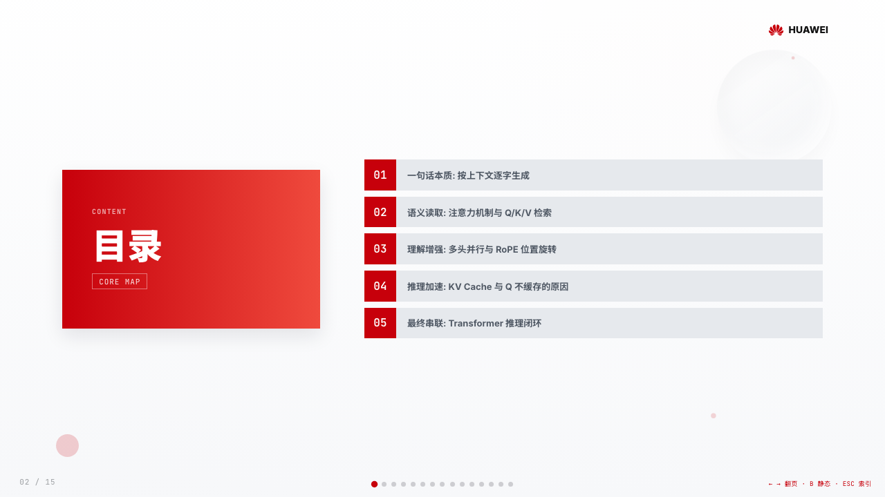
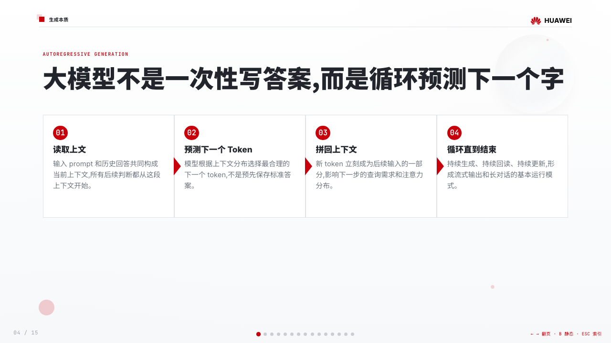
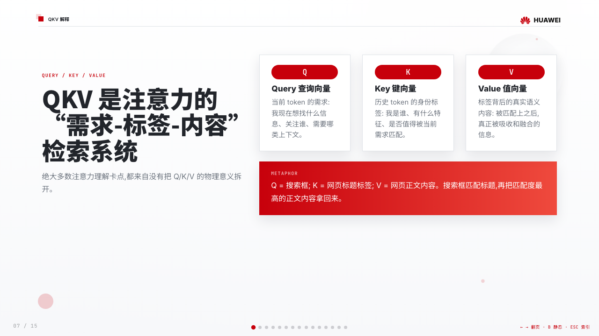
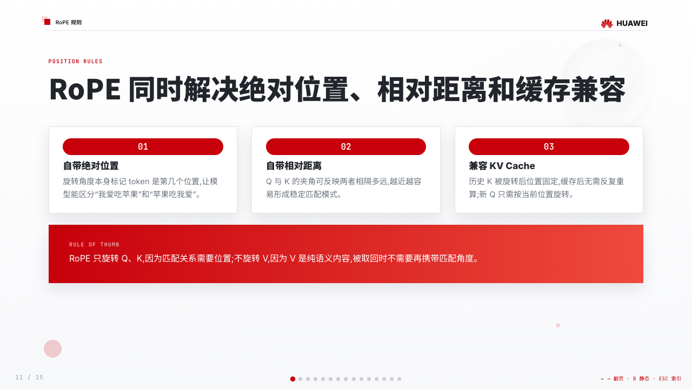
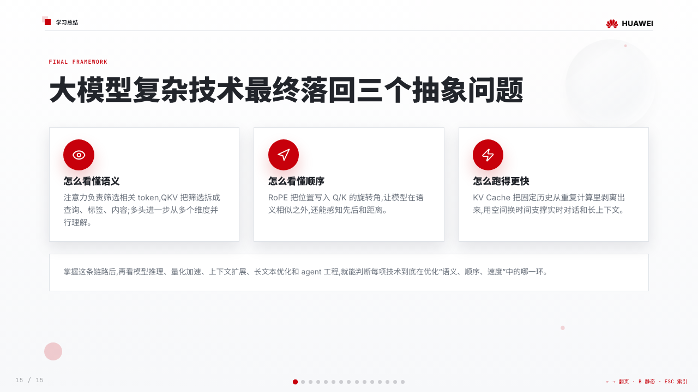

# Guizang PPT Skill · Web Decks / Images / Covers


[](https://zhenfund.feishu.cn/share/base/form/shrcn1lAANF659o7EpWnxlR1VOh?sessionid=)

An agent skill for Claude Code, Codex, and similar coding-agent environments. It generates **single-file HTML horizontal-swipe decks**, deck visuals, and social cover pages.

It ships with three visual systems:

- **Style A: editorial magazine × electronic ink**. Picture *Monocle* with code stitched in. Best for narrative talks, opinions, salons, and personal voice.
- **Style B: Swiss International Typographic Style**. Grid-first, one high-saturation anchor color, sharp rectangles, hairline rules, and extreme type contrast. Best for facts, products, analysis, and frameworks.
- **Style C: Huawei Corporate**. White/grey canvas, Huawei red, top-right brand lockup, agenda red rail, process arrows, data bars, and Human/Agent operation pages. Best for corporate summaries, work plans, business reports, and AI org-transformation decks.

> Distilled by [Guizang](https://x.com/op7418) from offline talks like "One-Person Company: Organizations Folded by AI" and "A New Way of Working." Every pitfall hit during those decks is logged in `checklist.md`.

**Old Theme · Style A Editorial Magazine**


**New Theme · Style B Swiss International**


**New Theme · Style C Huawei Corporate**








## 30-second start

```bash
npx skills add https://github.com/op7418/guizang-ppt-skill --skill guizang-ppt-skill
```

Or paste this to an AI agent with shell access:

```text
Install guizang-ppt-skill for me. Clone https://github.com/op7418/guizang-ppt-skill into ~/.claude/skills/guizang-ppt-skill, then verify that SKILL.md, assets/, and references/ exist.
```

If you already installed it, update with:

```text
Update guizang-ppt-skill for me. Go to ~/.claude/skills/guizang-ppt-skill, run git pull, then tell me the latest commit.
```

Then ask your agent:

```text
Create a Swiss-style deck from this article, around 7 slides, with 2-3 generated visuals.
```

Other useful prompts:

```text
Turn this Markdown file into an editorial magazine-style presentation.
Create a 10-slide company summary deck in the Huawei corporate report style.
Create a 21:9 social cover from the core idea of this deck.
Redesign this product screenshot as a 16:10 slide visual.
```

## What you get

- 🖋 **Three visual systems**: editorial storytelling for Style A, factual Swiss structure for Style B, red/grey corporate reporting and AI-org material for Style C
- 📐 **Horizontal swipe navigation**: ← → arrows / scroll wheel / touch swipe / bottom dots / ESC for index
- 🧩 **Style A 10 layouts**: cover, divider, big numbers, image/text, image grid, pipeline, comparison, and more
- 🧱 **Style B 22 locked layouts**: Cover, Statement, KPI Tower, Loop Diagram, Duo Compare, Image Hero, Closing Manifesto, and more
- 🧾 **Style C 42 corporate-report / business-plan / AI-org layouts**: Huawei Cover, Agenda, Section, Timeline, Data Bars, Process Arrow, Image Grid, KPI Dashboard, Map Locations, Photo Quote, Market Size, Pricing Table, SWOT, Gantt, Human Agent Loop, Org Protocol, Matching Engine, Before/After Case, and more
- 🎨 **Curated theme presets**: 5 electronic-ink themes for Style A, 4 Swiss anchor-color themes for Style B, 3 Huawei corporate red/grey themes for Style C
- 🖼 **Optional Codex image flow**: generate documentary photos, infographics, flow diagrams, system maps, and UI scenes with GPT-Image 2.0 / GPT-M 2.0, then insert them at template-safe ratios
- 📰 **Social covers**: generate 21:9 WeChat cover images, 1:1 share cards, 3:4 Xiaohongshu covers, video thumbnails, and related variants
- 📴 **Low-power static mode**: press `B` to turn WebGL / canvas animation into static visuals
- 📄 **Single HTML file** — no build, no server, open directly in the browser

## Fits / Doesn't fit

**✅ Fits**: offline talks, industry keynotes, private salons, AI product launches, demo day, presentations with strong personal voice

**❌ Doesn't fit**: data-heavy tables, training decks (density too low), multi-user collaborative editing (static HTML)

## Common use cases

| Task | Recommended flow |
|------|------------------|
| Long article to talk deck | Extract the core argument, then build a 6-10 slide rhythm |
| Framework / product analysis | Use Style B Swiss with locked layouts and 21:9 hero visuals |
| Company summary / work plan / business report / AI org transformation | Use Style C Huawei Corporate with H01-H42 corporate / business-plan / AI-org layouts |
| Personal talk / opinion piece | Use Style A editorial magazine for stronger narrative rhythm |
| Deck visuals | In Codex, generate photos, infographics, flow diagrams, system maps, or UI scenes |
| Social covers | Generate 21:9 main covers, 1:1 share cards, 3:4 vertical covers, and video thumbnails from the same idea |
| Screenshot normalization | Redesign raw screenshots into template-safe ratios before inserting them into slides |

## Why HTML decks

- **Agent-native editing**: HTML / CSS is plain text, so agents can read, edit, and validate it directly.
- **Higher visual density than Markdown**: precise layout, positioning, motion, interactivity, and cover formats.
- **Lightweight delivery**: one HTML file can be opened, presented, sent, screenshotted, or recorded.
- **Better quality gates**: Swiss and Huawei Corporate validators catch layout drift, unsafe image placement, brand-slot issues, centered body titles, and SVG text traps.
- **One visual system across outputs**: decks, generated visuals, covers, and screenshot redesigns can share the same style rules.

## Platform support

| Platform | Status | Notes |
|----------|--------|-------|
| Claude Code | Supported | Native Skill workflow for creating and iterating HTML decks |
| Codex | Supported | Good for deck generation, image generation, and browser-based visual QA |
| Cursor / other local agents | Works | Requires filesystem access and shell execution |
| WorkBuddy | In adaptation | Marketplace-ready version is being prepared separately |
| Plain chatbot | Not recommended | Without filesystem and browser preview, full deck generation is hard to stabilize |

## Install

### Option 1: One-line install (recommended)

```bash
npx skills add https://github.com/op7418/guizang-ppt-skill --skill guizang-ppt-skill
```

### Option 2: Paste this to an AI

> Install the `guizang-ppt-skill` Claude Code skill for me. Steps:
>
> 1. Make sure `~/.claude/skills/` exists (create if not)
> 2. Run `git clone https://github.com/op7418/guizang-ppt-skill.git ~/.claude/skills/guizang-ppt-skill`
> 3. Verify: `ls ~/.claude/skills/guizang-ppt-skill/` should show `SKILL.md`, `assets/`, `references/`
> 4. Tell me when done. Later, saying things like "make me a magazine-style deck" will trigger this skill.

Paste the block above into Claude Code / Cursor / any AI agent with shell access and it handles the install.

### Option 3: Manual CLI

```bash
git clone https://github.com/op7418/guizang-ppt-skill.git ~/.claude/skills/guizang-ppt-skill
```

### How to trigger it

Once installed, Claude Code auto-detects the skill. Trigger phrases:

- "Make me a magazine-style deck"
- "Make me a Swiss-style deck"
- "Generate a horizontal swipe deck"
- "Editorial magazine style presentation"
- "Electronic ink slides for my talk"
- "Create a company summary deck in Huawei corporate report style"
- "Create a 21:9 WeChat cover from this article"
- "Create a 1:1 share card from this deck"

## Workflow

The skill is a structured workflow; the agent walks you through each step:

1. **Choose style** — Style A editorial magazine, Style B Swiss International, or Style C Huawei Corporate
2. **Clarify intent** — 7-question checklist: style, audience, duration, source material, images/screenshots, theme, hard constraints
3. **Copy template** — Style A uses `assets/template.html`; Style B uses `assets/template-swiss.html`; Style C uses `assets/template-huawei.html`
4. **Fill content** — create a rhythm plan, then choose and adapt the matching layout skeletons
5. **Optional image generation** — in Codex, ask whether to use GPT-Image 2.0 / GPT-M 2.0 images, then insert them at page-appropriate ratios
6. **Self-check** — match against `references/checklist.md`; P0 issues must all pass; Swiss and Huawei Corporate decks must also pass their layout validators
7. **Preview** — open the HTML in a browser
8. **Iterate** — use inline styles to tune font size, height, spacing

Full spec in [`SKILL.md`](./SKILL.md).

## Style B Swiss

The Swiss theme is a strict layout system, not just a CSS skin.

- **22 named layouts**: body slides must use `S01` to `S22`; do not invent new structures
- **4 anchor colors**: International Klein Blue, lemon yellow, lemon green, safety orange
- **Grid lock**: 16-column grid, sharp rectangles, 1px hairlines, no shadows, no gradients, no rounded cards
- **Chinese title scaling**: all-Chinese headlines should be one step smaller to preserve space for content and images
- **Image/text bottom alignment**: text and image blocks should align at the bottom in left/right image layouts, while staying clear of pagination controls
- **Image slots**: images must sit in template-defined `data-image-slot` regions, often generated at 21:9 or 16:10
- **Hard validation**: the validator catches centered body titles, experimental layouts, visible SVG text, and images placed outside slots

Swiss validation:

```bash
node scripts/validate-swiss-deck.mjs path/to/index.html
```

## Style C Huawei Corporate

Huawei Corporate is a red/grey enterprise-report system, not just a red theme. It fits company summaries, work plans, business plans, and AI organization, Human/Agent collaboration, and operating-mechanism material.

- **42 named layouts**: body slides should prefer `H01` to `H42`, covering cover/agenda/section slides, body content, data, process, proof, business plans, and H37-H42 AI-org pages
- **New AI-org content shapes**: H37 Human Agent Loop, H38 On/In Governance Split, H39 Org Protocol Board, H40 Matching Engine, H41 Metaphor Mapping, H42 Before/After Case
- **Equal-size sibling containers**: sibling cards, steps, roles, metrics, and triggers should stay as close as possible in width and height; prefer `.grid-*`, `.same-size`, `.equal-children`, and `.mini-card`
- **Fixed brand and pagination**: use `.brand-lockup` in the top-right; page numbers are auto-generated at bottom-left as `.page-no`; do not handwrite page numbers inside `.chrome`
- **Red/grey report feel**: on body slides, use red for anchors, numbers, arrows, and data emphasis; reserve large red fields for cover, agenda, section, and closing slides
- **Hard validation**: template rules and deck rules are validated separately so layout extensions, docs, and validators stay in sync

Huawei Corporate validation:

```bash
node scripts/validate-huawei-template.mjs
node scripts/validate-huawei-deck.mjs path/to/index.html
```

## Codex Image Flow

In Codex, after the first deck draft is ready, the agent can ask whether the user wants generated visuals. Once confirmed, choose an image type or style. Common types include:

- Documentary photos: Fuji / Leica-like real-world scenes that add human texture
- Infographics / flow diagrams / comparison charts / system maps: for concepts that cannot be explained well with photos
- Screenshot framing / screenshot redesigns: preserve raw screenshots with bundled background assets and a CleanShot X-style canvas first; use UI scene generation only when the screenshot needs reconstruction
- Data posters / charts: turn key numbers into insert-ready visual assets
- Multi-image compositions: useful for ultra-wide slots where three unrelated 16:9 images would break the grid

Generated images must follow four core rules:

- Treat the image as an embedded asset, not a standalone slide: no footer, page bottom, title, page number, corner mark, signature, or decorative border
- Match the deck language: Chinese decks use Chinese labels inside infographics, English decks use English labels
- Match the slot ratio before generation: 21:9 for many Swiss hero slots, 16:9 / 16:10 for common main visuals, 16:10 for UI scenes, fixed equal heights for image grids
- When a raw screenshot must stay faithful, read `references/screenshot-framing.md` first and use bundled `assets/screenshot-backgrounds/` backgrounds plus programmatic scaling, padding, and alignment instead of redrawing the screenshot by default

Image prompts live in [`references/image-prompts.md`](./references/image-prompts.md). Screenshot framing lives in [`references/screenshot-framing.md`](./references/screenshot-framing.md).

## Cover Generation

The skill can also turn an article or deck idea into platform covers:

- **WeChat main cover**: 21:9, headline-first, with one visual anchor
- **WeChat share card**: 1:1, visually paired with the 21:9 cover
- **Xiaohongshu cover / carousel**: 3:4, large title, consistent type scale across a batch
- **Video thumbnail**: 16:9, title + subtitle + one focal visual

The same rule applies: use a few strong keywords, keep the title as the visual center, and do not fill the canvas with body copy.

## Example prompts

Copy any of these prompts into your agent, then attach your article, Markdown file, or image assets:

```text
Create an 8-slide Swiss-style deck from this article, with 3 generated visuals matched to the template image slots.
```

```text
Turn this product analysis document into an editorial magazine-style deck with a strong narrative rhythm.
```

```text
From this deck's core idea, create two covers: a 21:9 main cover and a visually paired 1:1 share card.
```

```text
Redesign these product screenshots into consistent 16:10 slide visuals. Preserve key UI information; do not add slide titles or footers inside the images.
```

## Directory

```
guizang-ppt-skill/
├── SKILL.md              ← main skill file: workflow, principles, common mistakes
├── README.md             ← Chinese README
├── README.en.md          ← this file
├── screenshots/
│   └── huawei-slide-*.png ← Style C Huawei Corporate slide screenshots
├── assets/
│   ├── template.html         ← Style A editorial magazine template
│   ├── template-swiss.html   ← Style B Swiss template
│   ├── template-huawei.html  ← Style C Huawei Corporate template
│   └── screenshot-backgrounds/ ← bundled WebP screenshot backgrounds: 5 style-a / 4 style-b
├── scripts/
│   ├── validate-swiss-deck.mjs ← Swiss layout validator
│   ├── validate-huawei-template.mjs ← Huawei Corporate template validator
│   └── validate-huawei-deck.mjs ← Huawei Corporate deck validator
└── references/
    ├── components.md     ← component catalog (type, color, grid, icons, callout, stat, pipeline)
    ├── layouts.md        ← 10 layout skeletons (paste-ready)
    ├── layouts-swiss.md  ← 22 locked Swiss layouts
    ├── layouts-huawei.md ← 42 Huawei Corporate / business-plan / AI-org layouts
    ├── swiss-layout-lock.md ← Swiss fidelity and layout hard rules
    ├── themes.md         ← 5 theme presets (pick, don't customize)
    ├── themes-swiss.md   ← 4 Swiss anchor-color themes
    ├── themes-huawei.md  ← 3 Huawei Corporate red/grey themes
    ├── image-prompts.md  ← GPT-Image 2.0 / GPT-M 2.0 image types, ratios, and base prompts
    ├── screenshot-framing.md ← CleanShot X-style screenshot framing semantics
    └── checklist.md      ← quality checklist (P0 / P1 / P2 / P3 tiers)
```

## Theme presets

Pick from the theme file that matches the selected style. **Custom hex values are not allowed** — protecting the aesthetic matters more than freedom of choice.

### Style A Editorial Themes

| Preview | Theme | Core colors and best for |
|---------|-------|--------------------------|
|  | 🖋 **Ink Classic** | `#0a0a0b` / `#f1efea`. General default, commercial launches, when in doubt. |
|  | 🌊 **Indigo Porcelain** | `#0a1f3d` / `#f1f3f5`. Tech, research, AI, technical keynotes. |
|  | 🌿 **Forest Ink** | `#1a2e1f` / `#f5f1e8`. Nature, sustainability, culture, non-fiction. |
|  | 🍂 **Kraft Paper** | `#2a1e13` / `#eedfc7`. Nostalgic, humanist, literary, indie zines. |
|  | 🌙 **Dune** | `#1f1a14` / `#f0e6d2`. Art, design, creative, fashion, gallery-like decks. |

Switching themes only requires replacing the 6 variables at the top of `template.html`'s `:root{}` block — all other CSS flows through `var(--...)`.

### Style B Swiss Themes

Pick from `references/themes-swiss.md`. **Custom hex values are not allowed** here either.

| Preview | Theme | Anchor color and best for |
|---------|-------|---------------------------|
|  | 🔵 **International Klein Blue** | `#002FA7`. Default, commercial launches, AI products, frameworks. |
|  | 🟡 **Lemon Yellow** | `#FFD500`. Youth, sports, retail, consumer goods, Y2K retro. |
|  | 🟢 **Lemon Green** | `#C5E803`. Ecology, sustainability, health, Gen Z brands. |
|  | 🟠 **Safety Orange** | `#FF6B35`. Alerts, news, industrial topics, sports, energetic themes. |

If the user asks for a Swiss-style deck without specifying color, default to International Klein Blue.

### Style C Huawei Corporate Themes

Pick from `references/themes-huawei.md`. **Custom hex values are not allowed** here either.

| Theme | Core color and best for |
|-------|--------------------------|
| **Classic Red** | `#c7000b`. Default Huawei red/grey corporate reports, company summaries, work plans, and business decks. |
| **Deep Executive** | `#b00010`. More restrained; best for executive, strategy, and business-plan material. |
| **Cloud Tech** | `#d20a2e`. Cooler and more modern; best for ICT, cloud, AI, and R&D summaries. |

If the user asks for a "Huawei PPT" or a red/grey corporate template without specifying a theme, default to Classic Red.

## Core design principles

1. **Restraint over flash** — WebGL backgrounds only bleed through on hero pages
2. **Structure over decoration** — information hierarchy via type size + typeface + grid whitespace, not shadows or floating cards
3. **Images are first-class citizens** — align them with the body content area, keep ratios stable, crop only from the bottom, and preserve top/sides
4. **Generated visuals are assets** — keep only the core photo / chart / UI; do not render slide titles, footers, or corner marks inside the image
5. **Rhythm lives on hero pages** — hero / non-hero alternation keeps the eye from fatiguing
6. **Dynamic effects must be optional** — `B` toggles static mode so animation never becomes a reading burden
7. **Terms stay consistent** — Skills is Skills; no mix-and-match translations
8. **Swiss layouts stay locked** — Style B should restore and reuse the original 22-page layout system instead of inventing unrelated pages
9. **Huawei Corporate stays red/grey and report-like** — Style C uses red, black, grey, and white as the primary visual system; body slides should not overuse full-screen red.
10. **Huawei sibling containers should be equal-sized** — Style C sibling cards, steps, roles, and metrics should stay close in width and height, using the template's existing equal-size utilities first.

## Visual references

- [*Monocle*](https://monocle.com) magazine layouts
- YC Garry Tan — "Thin Harness, Fat Skills"
- Massimo Vignelli / Helvetica Forever / Swiss International Typographic Style
- Huawei corporate-report, technology-summary, and red/grey business-report visual language
- Guizang's offline talk deck series

## Roadmap

- Add more real-world examples and openable HTML deck demos
- Expand cover formats for more publishing platforms
- Add more Swiss layout validation rules
- Improve screenshot redesign and infographic generation workflows
- Prepare marketplace-specific variants such as WorkBuddy
- Add more curated theme packs while keeping custom colors restricted

## FAQ

**Can it export to PPTX?**
The main output is HTML. You can present it in a browser, screenshot it, or record it. PPTX conversion can be done as a separate workflow, but it is not the core path today.

**Why are custom colors not allowed?**
The skill is designed for stable visual output. Arbitrary colors often break the system, so decks must use curated presets.

**Can I add my own layout?**
Yes. Style A layouts can be extended in `references/layouts.md`. Style B is stricter: update `template-swiss.html`, `layouts-swiss.md`, `swiss-layout-lock.md`, and the validator together. Style C extensions must update `template-huawei.html`, `references/layouts-huawei.md`, and the `scripts/validate-huawei-*` validators together.

**Is Codex image generation required?**
No. Decks work without generated images. The image flow is only used when you need photos, infographics, UI scenes, or covers.

**How do I update the skill?**
Run the install command again, or run `git pull` inside your local skill directory.

## Contributing

Bugs, layout issues, new layout requests — Issues and PRs welcome. Prioritize:

- Add new classes to `template.html` first; don't let `layouts.md` reference undefined classes
- When changing `template-swiss.html`, update `layouts-swiss.md` and `swiss-layout-lock.md` together
- When changing `template-huawei.html`, update `layouts-huawei.md` and `scripts/validate-huawei-*` together
- When adding Swiss rules, update `scripts/validate-swiss-deck.mjs`
- When adding Huawei Corporate rules, update README, `SKILL.md`, `references/layouts-huawei.md`, and the validators together
- Log pitfalls into `checklist.md` at the matching P0 / P1 / P2 / P3 tier
- New theme colors go into the matching `themes*.md` file with a recommended use case

## License

MIT © 2026 [op7418](https://github.com/op7418)
